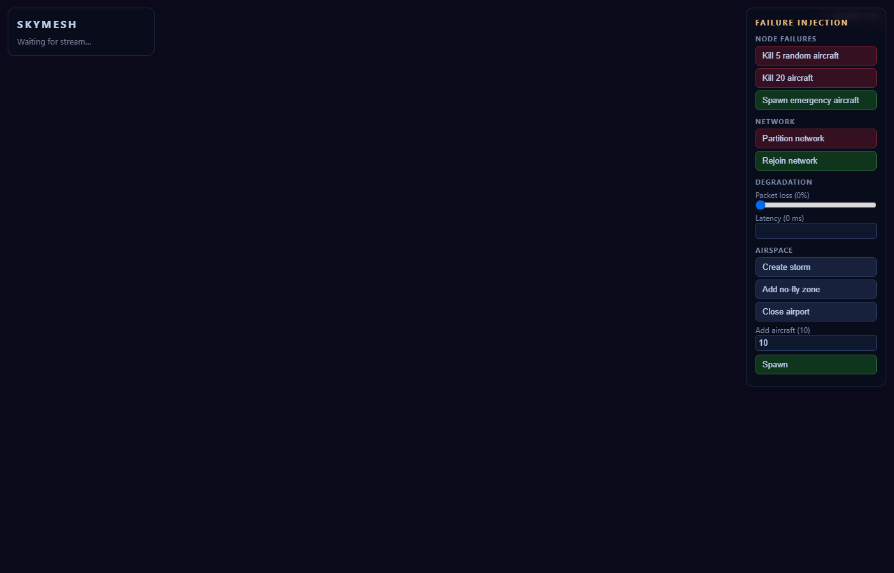

# SkyMesh — Decentralized Autonomous Airspace

**Failure-Resilient Peer-to-Peer Aircraft Conflict Resolution Simulator**

> *Break the network. Keep the sky safe.*

---

## What is SkyMesh?

SkyMesh is a real-time simulation of **decentralized autonomous airspace coordination**. Instead of a central air-traffic-control server, every aircraft acts as an independent UDP peer. Nearby aircraft exchange state, predict 4D trajectory conflicts, negotiate maneuvers, and converge on safe paths — all without a central authority.

The simulator is designed as a **failure-injection laboratory**: deliberately break the system (kill aircraft, inject packet loss, split the network) and watch it recover.

## Tech Stack

| Layer | Technology |
|-------|-----------|
| Backend / Simulation | Python 3.14 · asyncio · UDP multicast |
| REST + WebSocket | FastAPI · uvicorn |
| Visualization | React · TypeScript · Three.js |
| Communication | Real UDP datagrams (multicast group) |

## Quick Start

### Run everything (one command)

The backend serves the built SPA, REST API and WebSocket on a single port, so
one command runs the whole stack. A frontend build runs automatically the first
time (and whenever `frontend/dist` is missing); use `--build` to force one.

```bash
# one command → UI + API + socket on http://127.0.0.1:8000/
python start.py
python start.py --aircraft 100 --port 9000   # tune the sim / port
```

For frontend development with live reload, a dev launcher runs the backend and
Vite together (Vite proxies `/api` and `/ws` to the backend):

```bash
# one command → UI on http://localhost:5173 (hot reload) + API on :8000
python start_dev.py
```

### Backend (headless)

```bash
# install
python -m pip install -r backend/requirements.txt

# run 60 aircraft for 15 seconds
python -m backend.run --aircraft 60 --seconds 15
```

### Backend (server + API only)

```bash
python -m backend.run --serve --aircraft 60 --port 8000
# → http://127.0.0.1:8000/docs   (Swagger UI)
# → ws://127.0.0.1:8000/ws        (live state stream)
```

### Frontend (build manually, if you prefer)

```bash
cd frontend
npm install
npm run build          # produces frontend/dist
npm run dev            # dev server on http://localhost:5173 (proxies /api, /ws)
```



## REST API

| Endpoint | Method | Description |
|----------|--------|-------------|
| `/api/state` | GET | Full simulation snapshot |
| `/api/control/kill_random` | POST | Kill random aircraft `{count: 5}` |
| `/api/control/kill` | POST | Kill specific aircraft `{id: "A001"}` |
| `/api/control/spawn_emergency` | POST | Spawn emergency aircraft |
| `/api/control/partition` | POST | Split network into two partitions |
| `/api/control/rejoin` | POST | Restore full connectivity |
| `/api/control/packet_loss` | POST | Set packet loss `{value: 0.3}` |
| `/api/control/latency` | POST | Set latency `{ms: 200}` |
| `/api/control/storm` | POST | Add a storm obstacle |
| `/api/control/close_airport` | POST | Close a random airport |
| `/api/control/traffic` | POST | Add aircraft `{count: 20}` |

### WebSocket `/ws`

Pushes a full snapshot JSON at ~10 Hz while the simulation runs.

## Obstacle Avoidance

Storms and no-fly zones are vertical cylinders. Free-flying aircraft heading toward an obstacle re-route around it: each tick the agent projects a perpendicular `waypoint_around(position, destination, clearance)` detour through the obstacle's closest point and steers toward it until the straight line to the destination is clear again (the waypoint is recomputed every step to obey the turn-rate limit). The current waypoint is exposed per aircraft in the snapshot (`aircraft[].waypoint`).

## Architecture

```
┌──────────────────────┐
│   Simulation Engine  │  ← main async tick loop
└──────────┬───────────┘
           │
┌──────────┼────────────────┐
│          │                │
▼          ▼                ▼
Physics   Network         Events
│          │                │
│          │ UDP multicast  │
│          │                │
└──────────┼────────────────┘
           ▼
    Aircraft Agents (P2P)
     ↕ State broadcast    ↕
     ↕ 4D conflict detect ↕
     ↕ Distributed negotiate
     ↕ Trajectory commit
```

Each aircraft:
- has its own UDP socket (real datagrams)
- broadcasts state to a multicast group
- maintains a neighbor table (local world model)
- detects conflicts, proposes maneuvers, negotiates deterministically

## Core Algorithm

1. **Broadcast** state every ~2 Hz via UDP multicast
2. **Detect** 4D conflicts (X, Y, Z, Time) against neighbor trajectories
3. **Generate** candidate maneuvers (turn, climb, descend, speed)
4. **Filter** unsafe candidates against neighbors + airspace bounds
5. **Cost** each candidate (deviation × priority + risk + delay)
6. **Negotiate** pairwise: exchange proposals, deterministic winner
7. **Commit** winner's trajectory; loser continues straight

Deterministic tie-breaking: priority → cost → trajectory version → aircraft ID.

## Failure Injection

| Failure | How |
|---------|-----|
| Aircraft failure | `kill_random` — UDP stops, state becomes uncertain |
| Packet loss | `packet_loss` — random drop on outbound |
| Latency | `latency` — artificial delay on outbound |
| Network partition | `partition` — split by x-coordinate, block cross-group |
| Storm / no-fly zone | `storm` / `add_nofly` — geofence obstacle |
| Emergency traffic | `spawn_emergency` — high-priority aircraft |

## Running Tests

```bash
python -m pytest backend/tests -v
```

## Deploy (Render free tier + Cloudflare DNS)

The repo ships a `Dockerfile` (builds the frontend, runs the backend) and a
`render.yaml` blueprint. One container serves the UI, REST API and WebSocket.

1. **Render** → New → Blueprint (or Web Service) → connect this repo. The
   blueprint provisions a **free Docker web service** (`flight-sim`).
2. Add a custom domain in Render: **Settings → Custom Domains →
   `flightsim.rabidahal.com.np`**.
3. **Cloudflare DNS** → add a `CNAME` record: `flightsim` → the
   `<service>.onrender.com` host Render shows. Start **DNS-only (grey cloud)**
   so Render can issue its TLS certificate, then optionally switch to
   **proxied (orange)** with SSL/TLS mode set to **Full (strict)**.
4. Open `https://flightsim.rabidahal.com.np/` and confirm the UI loads, `/docs`
   responds, and `/ws` streams snapshots.

Free-tier notes: the service sleeps after ~15 min without inbound traffic and
takes about a minute to wake (the WebSocket heartbeat keeps it awake while a
browser is watching). The simulation state resets whenever the container
restarts.

## Project Structure

```
flight-sim/
├── backend/
│   ├── simulation/   # aircraft, physics, conflict, maneuvers, cost, negotiation
│   ├── network/      # UDP node, protocol, neighbor table
│   ├── engine/       # simulator, agent (per-node brain), metrics
│   ├── api/          # FastAPI + WebSocket
│   ├── tests/        # pytest
│   └── run.py        # entry point
├── frontend/         # React + Three.js (visualization)
│   ├── src/visualization/SkyScene.ts  # 3D scene (planes, sky, ground, airports)
│   └── dist/         # production build (generated, served by the backend)
├── docs/             # architecture, API, implementation log
└── skymesh.md        # original design document
```
